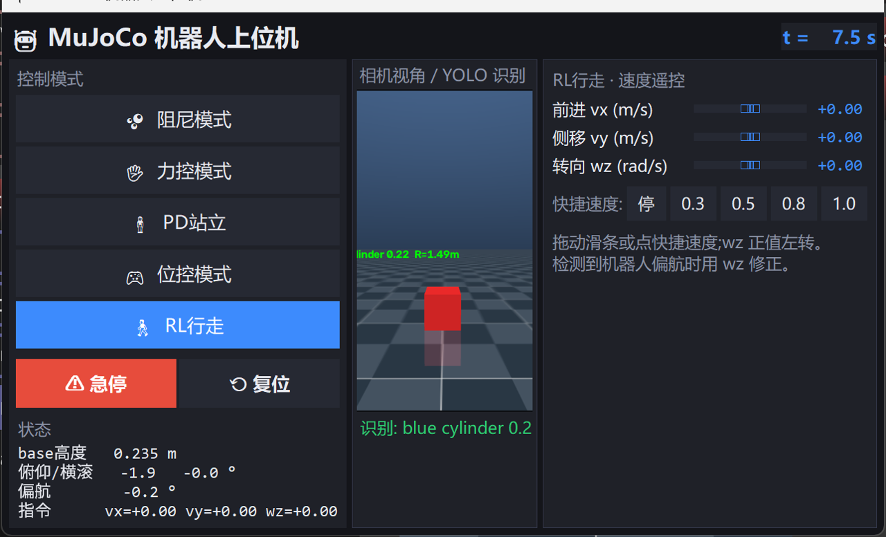

# mujoco-yolo-camera

一个**配置驱动**的 MuJoCo 仿真平台:任意机器人(Unitree Go2 四足 / G1 人形,可扩展)+
任意数量/位置的相机 + 场景物体,渲染 RGB 与深度,用 YOLO-World 开放词表检测目标并
反算距离与世界坐标。**换机器人、挪相机、加物体,只改 YAML,不改一行代码。**

## 目录结构

```
.
├── main.py              # 主程序:加载配置 -> 仿真 + 检测循环
├── dashboard.py         # 上位机:模式切换(阻尼/力控/PD站立/位控/RL行走)+ 滑条 + 状态
├── configs/             # 场景配置(一切可变项都在这里)
│   ├── go2.yaml         #   go2 + 车载前视相机 + 俯视相机 + 控制器 + walk 策略
│   ├── go2_terrain.yaml #   go2 + 程序化地形(楼梯/乱石地/高程图,复刻 llm-legged-lab demo)
│   └── g1.yaml          #   g1 人形,换机器人只是换一份配置
├── simulation/          # 仿真:配置加载 + MjSpec 运行时组装 + 仿真世界
│   ├── config.py        #   YAML -> SimConfig(dataclass)
│   ├── builder.py       #   机器人 + 物体 + 相机 + 地形 -> MjModel(无临时 XML)
│   ├── controller.py    #   控制层:五种控制模式 + RL 策略推理 + 高度扫描
│   ├── terrain.py       #   程序化地形(移植自 llm-legged-lab terrain_tool)
│   └── world.py         #   SimWorld:步进 / viewer / 实时节拍
├── assets/              # 资产库:一个文件夹 = 一种机器人(见 assets/README.md)
│   └── robots/
│       ├── go2/         #   go2.xml + OBJ mesh + robot.yaml(来自 unitree_mujoco)
│       └── g1/          #   g1_29dof.xml + STL mesh + robot.yaml(来自 unitree_ros)
├── sensors/             # 传感器:相机渲染与几何
│   └── camera.py        #   RGB/深度渲染、针孔内参、相机系<->世界系、图片读写
└── yolo/                # 感知
    ├── detector.py      #   YOLO-World 封装(类别/权重/阈值全配置)
    └── measure.py       #   bbox -> 深度中位数 -> 距离 + 相机系/世界系坐标
```

## 依赖

Python 3.10+,MuJoCo 3.x(用了 MjSpec 运行时组装 API):

```bash
pip install mujoco opencv-python numpy pyyaml ultralytics
```

首次运行 YOLO-World 会自动下载权重(约 338 MB)和 CLIP 文本编码器,均已被 git 忽略。

## 运行

```bash
# 上位机(推荐):模式切换 + 速度遥控 + 相机/YOLO 画面,详见下节
python dashboard.py
python dashboard.py --config configs/go2_terrain.yaml   # 地形场景上跑

# 纯仿真 + 检测循环(无 UI)
python main.py                            # configs/go2.yaml:viewer + 实时检测循环
python main.py --config configs/go2_terrain.yaml   # 地形场景(楼梯/乱石地/高程图)
python main.py --config configs/g1.yaml   # 换 G1 人形场景
python main.py --robot go2                # 命令行覆盖机器人
python main.py --oneshot                  # 无窗口:步进一小段、检测一次、存图退出
python main.py --no-yolo                  # 只跑仿真不检测
```

退出前最后一帧的 `latest_annotated.png` / oneshot 的 `rgb.png` `depth.png`
`annotated.png` 保存在 `outputs/`。

## 换机器人 / 挪相机 / 加物体:改配置就行

`configs/go2.yaml`(完整注释版):

```yaml
robot: go2                       # assets/robots/ 下的文件夹名,换 g1 只改这一行
spawn: [0, 0, 0.445]             # 可选:出生位置,省略用 robot.yaml 的默认值

objects:                         # 场景物体,name 就是 YOLO 类别
  - name: red box
    type: box                    # box / cylinder / sphere / capsule
    size: [0.16, 0.16, 0.16]     # 完整尺寸(米)
    pos: [1.2, 0, 0.30]
    rgba: [0.85, 0.15, 0.15, 1]

cameras:                         # 数量不限
  - name: head_cam
    attach: base_link            # 挂到机器人 body 上跟着动;省略这行 = 世界固定相机
    pos: [0.25, 0, 0.15]         # 挂载位置(或世界位置)
    lookat: [1.5, 0, 0.05]       # 看向一点;也可用 euler(度)/ quat / track
    fovy: 75
    width: 640
    height: 480
  - name: overview_cam
    pos: [1.8, -1.8, 1.8]
    track: BASE                  # 原生跟踪:始终看向某 body;BASE = 机器人根 body
    fovy: 60

yolo:
  enabled: true
  camera: head_cam               # 用哪台相机检测
  weights: yolov8s-worldv2.pt    # 可换任意权重,如 yolov8m-worldv2.pt / 本地 .pt 路径
  conf: 0.15
  interval: 0.5                  # 检测周期(秒)
```

### 添加新机器人

往 `assets/robots/<名字>/` 丢一份 MJCF + 写 5 行 `robot.yaml`(说明见
`assets/README.md`),任何 [mujoco_menagerie](https://github.com/google-deepmind/mujoco_menagerie)
模型都能直接进平台。根 body 没有 freejoint 会自动补;机器人 XML 里自带的
floor/light 会自动剥离;mesh 经内存加载,**项目放在中文路径下也能跑**
(MuJoCo 的 C 层 fopen 打不开非 ASCII 路径,平台用 Python 读文件 + `spec.assets`
字节流绕开了这个限制)。

### 程序化地形(参考 llm-legged-lab terrain_tool)

配置里的 `terrain:` 列表往场景里加地形元素,参数名与 llm-legged-lab 项目
`Mujoco/terrain_tool` 的 Add* 系列一致(euler 统一用"度")。
完整示例见 `configs/go2_terrain.yaml`:

```yaml
terrain:
  - type: stairs               # 楼梯:init_pos/yaw/width/height/length/stair_nums
    init_pos: [1.0, 4.0, 0.0]
  - type: suspend_stairs       # 悬浮楼梯:多一个 gap(板厚 = |height - gap|)
    init_pos: [1.0, 6.0, 0.0]
  - type: rough_ground         # 乱石地:随机方块阵,seed 固定可复现
    init_pos: [-2.5, 5.0, 0.0]
    nums: [10, 8]
    box_size: [0.5, 0.5, 0.5]
  - type: perlin_hfield        # Perlin 噪声高程图(numpy 自实现,免 noise 包)
    pos: [-1.5, 4.0, 0.0]
    size: [2.0, 1.5]
    height_scale: 0.2          # 起伏幅度,想更陡就调大
    octaves: 6
    seed: 0
  - type: image_hfield         # 图片生成高程图(灰度 = 高度)
    pos: [8.0, 8.0, 0.0]
    size: [4.0, 4.0]
    input_img: assets/terrain_demo.png
    invert_gray: false
  - type: box                  # 静态障碍箱(斜坡也是这样摆的)
    pos: [2.0, 2.0, 0.5]
    euler: [0.0, -28.6, 0.0]
    size: [3.0, 1.5, 0.1]
```

可推的箱子(push_box 场景)用 `objects:` 里的普通物体,支持 `mass`(千克)和
`friction([滑动, 扭转, 滚动])`,可被机器人推动:

```yaml
objects:
  - name: orange box
    type: box
    size: [0.6, 0.8, 0.24]
    pos: [0.8, 0.0, 0.12]
    mass: 4.0
    friction: [0.8, 0.6, 0.0]
```

高程图 PNG 全部在内存里生成/读取后以字节流喂给 MuJoCo(`spec.assets`),
不产生中间文件,不受中文路径影响。

## 上位机与控制模式

```bash
python dashboard.py                       # go2 上位机 + 3D viewer
python dashboard.py --config configs/go2_terrain.yaml   # 地形场上跑
```



深色界面上:

- **控制模式**(左侧,单击即切):阻尼模式 / 力控模式 / PD站立 / 位控模式 / RL行走
- **相机视角 / YOLO 识别**(中央):`yolo.camera` 指定相机的实时画面,
  检测框 + 类别/置信度/距离实时叠加
- **右侧调节面板**(随模式切换):
  - RL行走:vx/vy/wz 速度滑条(−1~1)+ 快捷速度按钮,拖动即走
  - 位控模式:12 个关节目标角滑条(度)
  - 力控模式:12 个关节力矩滑条(N·m)
- **急停 / 复位**:急停 = 速度清零并切回 PD站立;复位 = 回到默认站姿出生点
- 左下角实时状态:base 高度、姿态角、当前指令

五种模式实时切换(策略来自 `controller.policy` 指向的 TorchScript):

| 模式 | 行为 |
|---|---|
| 阻尼模式 | tau = -kd·dq,关节软,机器人瘫软 |
| 力控模式 | 12 个力矩滑条直接输出 tau |
| PD站立 | 锁默认站姿 tau = kp(q°-q) - kd·dq |
| 位控模式 | 12 个角度滑条(度),PD 跟踪摆姿势 |
| RL行走 | 策略 50Hz 出目标角 + PD 跟踪,vx/vy/wz 滑条遥控 |

### RL 策略接入(sim2sim)

已对接 llm-legged-lab 训练的 go2 walk 策略
(`ModelBackup/TransPolicy/WalkFlatLowHeightTransfer.pt`,配置里可换任意 TorchScript)。
部署链路逐项对齐:

- **观测 232 维**,按 deploy.yaml 文件序(= 训练序)拼接:
  `[ang_vel 3, projected_gravity 3, 速度指令 3, joint_pos_rel 12, joint_vel_rel 12, last_action 12, height_scan 187]`
- **关节序**:配置 `joint_names` 即策略关节序
  `[FL_hip, FR_hip, RL_hip, RR_hip, FL_thigh, …]`(与 deploy.yaml 的 joint_ids_map 等价,
  按"名字"配置,内部自动映射到 MuJoCo 执行器)
- **高度扫描**:17×11 网格(1.6×1.0m @0.1),yaw 对齐,射线 +20m 向下,
  `heights = base_z - hit_z - 0.5`,只打 geomgroup (1,1,0,0,0,0)(不打机器人自身)
- **动作**:q_des = default + scale·clip(action),50Hz;PD kp=25 kd=0.5;指令 EMA 0.2 平滑

踩过的坑(换策略时注意):

1. **MuJoCo free joint 的 qvel 角速度在"父子正中帧"**,不是体系——必须用
   `mj_objectVelocity` 取体系角速度,静止时两者相等(能站稳),一动就错。
2. **IsaacLab 观测拼接顺序**:deploy.yaml 生成器直接取自训练环境管理器
   ("order preserved"),配置里 `obs_order: yaml` 即训练序。
3. **出生高度**:从 0.445m 落下会产生分布外的高度扫描瞬态,策略会锁死站立;
   `spawn` 设为站立高度(0.30)即可正常起步。
4. torch/CVK 的 fopen 打不开中文路径:策略用字节流加载(`BytesIO`)。

g1 的 controller 段已配好 12 个腿部关节(阻尼/力控/PD站立/位控),
填入 g1 的 TorchScript 路径即可启用 RL行走。

## 程序化使用

```python
from simulation import load_config, SimWorld
from yolo import YoloWorldDetector, measure_detections

cfg = load_config("configs/go2.yaml")
world = SimWorld(cfg)                    # 相机在 world.cameras: {名字: SimCamera}
detector = YoloWorldDetector(cfg.yolo.weights, cfg.yolo_classes(), conf=0.15)

for _ in range(250):
    world.step()
cam = world.cameras["head_cam"]
rgb, depth = cam.render_rgbd()
dets = measure_detections(detector.detect(rgb), cam, depth)   # 填充 distance/xyz_world
for d in dets:
    print(d.name, d.conf, d.distance, d.xyz_world)
print("机器人位姿:", world.robot_base_pose())
```

## 距离的计算方式

对 bbox 区域取深度中位数 `z`,按针孔模型反投影:

```
x = (u - cx) * z / fx,  y = (v - cy) * z / fy,  R = sqrt(x² + y² + z²)
fx = fy = H / (2·tan(fovy/2)),  cx = W/2,  cy = H/2
```

注意深度相机测的是**可见表面**(比物体质心近半个物体尺寸),坐标换算约定:
`xyz_cam` 为 OpenCV 惯例(x 右、y 下、z 向前为正),`xyz_world` 已经用相机外参
转到世界系。世界坐标的真值可以拿 `world.model.body("red box").id` 后的
`world.data.xpos` 对账,实测误差在厘米级(主要是表面 vs 质心的差)。

## 说明

- `main.py` 需要 GUI;`--oneshot` 离屏渲染,无头环境也能跑。
- 纯色几何体对小模型(yolov8s-world)召回一般,提升识别:换更强权重
  (如 `yolov8m-worldv2.pt`)、给物体加纹理/复杂形状、类别写同义词
  (如 `red cube` / `red box`)。
- 旧版单文件脚本(点击测距、SAM3 分割)已移除,可在 git 历史中找回;
  需要的话可以按新结构移植回来。
